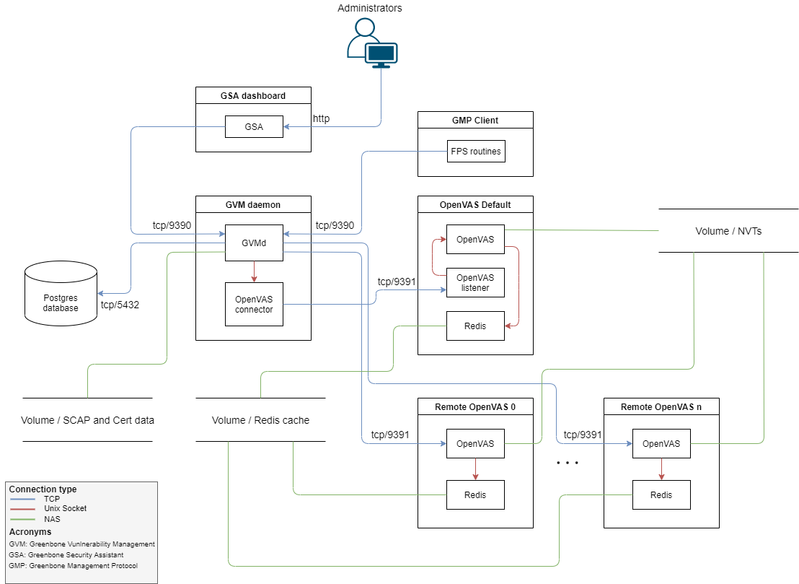

# GVM deployment

## Introduction
This project proposes and implements the following deployment of Greenbone Vulnerability Management using Docker containers.




## Docker images
The project builds the following docker images:
- Greenbone Vulnerability Manager version 9.0.1 built based on [admirito's GVM PPA](https://launchpad.net/~mrazavi/+archive/ubuntu/gvm).
- PostgreSQL 12 Database with `libgvm-pg-server` built based on [admirito's GVM PPA](https://launchpad.net/~mrazavi/+archive/ubuntu/gvm)
- Greenbone Security Assistant version 9.0 built from https://github.com/greenbone/gsa.git. 
- OpenVAS scanner version 7.0 built from https://github.com/greenbone/openvas.git.

## Development
For testing and development, you can deploy the GVM components with `docker-compose`:

```bash
docker-compose -f docker-compose.yml up
```
GSA dashboard will then be accessible on http://localhost:8080.

To run NVT data sync:
```bash
docker-compose -f docker-compose.yml -f nvt-sync.yml up 
```

To run SCAP data sync:
```bash
docker-compose -f docker-compose.yml -f scap-sync.yml up 
```

To run CERT data sync:
```bash
docker-compose -f docker-compose.yml -f cert-sync.yml up 
```

To add a remote OpenVAS scanner:
1. Generate certificates for the new scanner:
```bash
docker-compose -f docker-compose.yml -f scanner-certs.yml up 
```
2. Create the scanner container:
```bash
docker-compose -f docker-compose.yml -f add-scanner.yml up 
```
3. Add the scanner to GVM:
```bash
$ docker exec -it gvm-deployment_gvmd_1 ./add-scanner.sh
Scanner Name: openvas-1
Scanner Host: openvas-1
Scanner Port [9390]:
Scanner Type [OpenVAS]:
Scanner CA certificate [/usr/var/lib/gvm/cacert.pem]:
Scanner public key [/usr/var/lib/gvm/cert.pem]:
Scanner private key [/usr/var/lib/gvm/key.pem]:
Adding scanner openvas-1...
md   main:MESSAGE:2020-10-09 16h15.55 utc:1349:    Greenbone Vulnerability Manager version 9.0.1 (DB revision 221)
md manage:   INFO:2020-10-09 16h15.55 utc:1349:    Creating scanner.
md manage:WARNING:2020-10-09 16h15.55 utc:1349: database must be initialised from scanner
util gpgme:MESSAGE:2020-10-09 16h16.01 utc:1349: Setting GnuPG dir to '/var/lib/gvm/gvmd/gnupg'
util gpgme:MESSAGE:2020-10-09 16h16.01 utc:1349: Using OpenPGP engine version '2.2.19'
Scanner created.
```

## Production
To deploy GVM components in Kubernetes cluster for production, use the helm chart described in [chart/README](./chart/README.md).

## Resources
- https://github.com/admirito/gvm-containers
